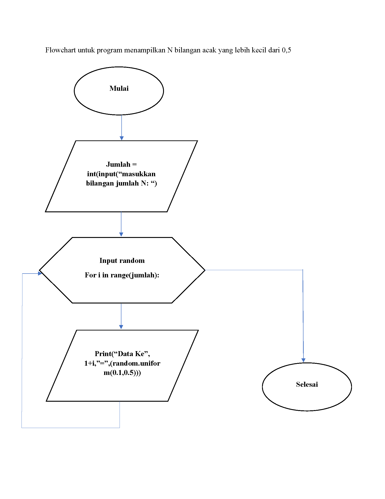
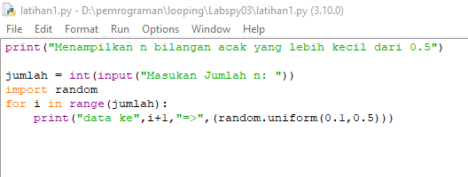
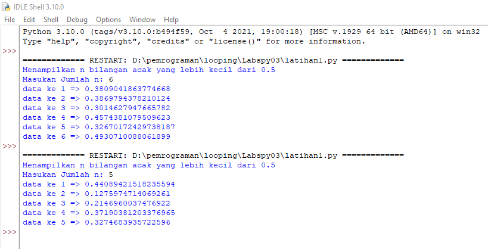
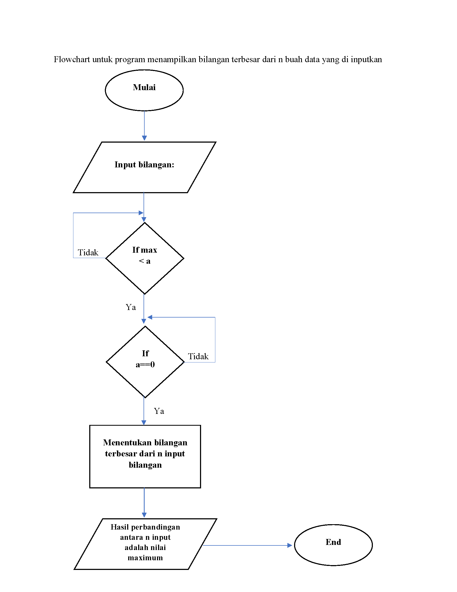
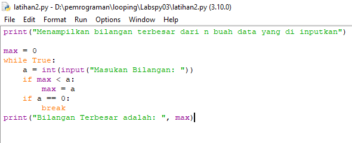
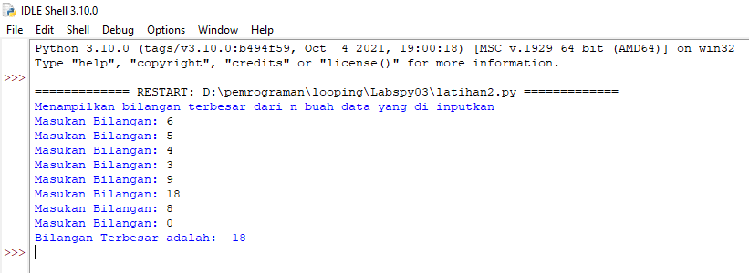

# Labspy03
# Latihan 1
## Membuat Prrogram Untuk Menampilkan n Bilangan Acak yang Lebih Kecil dari 0.5
### Flowchart program
- Berikut flowchart program dari program latihan 1, untuk menampilkan n bilangan acak yang lebih kecil dari 0.5

### Penjelasan alur program 
 > print("Menampilkan n bilangan acak yang lebih kecil dari 0.5") 
-  itu hanya perintah untuk menamilkan judul saja
 > jumlah = int(input("Masukan jumlah n: )) 
-  Adalah perinntah untuk menginputkan nilai n tersebut
 > import random
-  Adalah perintah untuk menginportkan built-in random yang telah tersedia di python
 > for in range (jumlah): 
-  Adalah perintah untuk, i sebagai integer dalam baris jumlah
 > print ("data ke",i+1,"=",(random.uniform(0.1,0.5))) 
-  Adalah perintah untuk menampilkan hasil yang telah di input dengan ketentuan random uniform mulai dari nilai 0.1 sampai 0.5

### Berikut gambaran programnya

### Berikut hasil program yang saya buat

### Latihan 1 selesai
===========================================================================================================================================================
# Latihan 2
## Membuat Program Untuk Menampilkan Bilangan Terbesar dari n Buah Data yang Diinputkan
### Flowchart program
- Berikut flowchart program menampilkan bilangan terbesar dari n buah data yang diinputkan

### Penjelasan alur program
 > print("Menampilkan bilangan terbesar dari n buah data yang diinput") 
- Perintah untuk menampilkan judul program
 > max = 0 
- Adalah perintah untuk pengulangan hingga waktu yang ditentukan
 > a = int(input("Masukan Bilangan: ")) 
- Adalah perintah untuk menginput nilai integer
 > if max < a : 
- Adalah printah untuk tipe data if, atau jika, maksimal lebih kecil dari a atau integer
 > max = a 
- Perintah untuk maksimal sama dengan a atau integer
 > if a==0 :
- Perintah untuk tipe data  if atau jika a sama dengan 0 maka 
 > break 
- Perintah untuk mengakhiri pengulangan, jadi jika menginput nilai 0, maka pengulangan berakhir atau selesai
 > print("bilangan Terbesar adalah: ",max)
- Adalah perintah untuk menampilkan hasil bilangan yang terbesar dari angka-angka yang telah terinput
### Berikut gambaran programnya

### dan berikut hasil dari program, saat dijalankan
