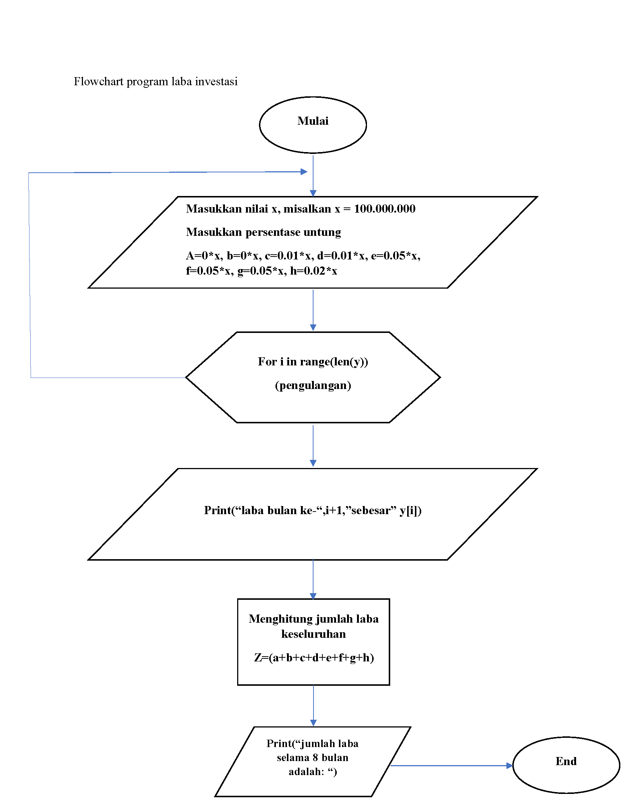
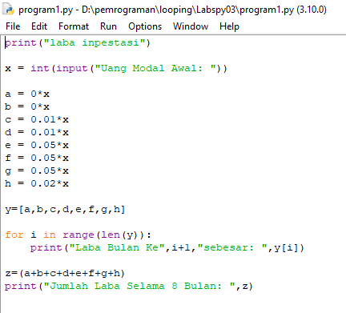
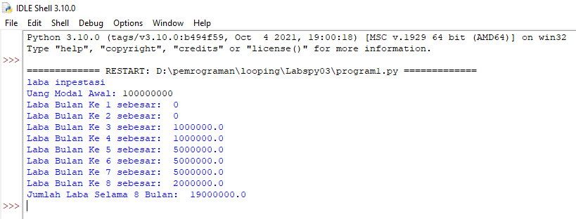

# Labspy03
# Latihan 1
## Membuat Prrogram Untuk Menampilkan n Bilangan Acak yang Lebih Kecil dari 0.5
### Flowchart program
- Berikut flowchart program dari program latihan 1, untuk menampilkan n bilangan acak yang lebih kecil dari 0.5

### Penjelasan alur program 
 > print("Menampilkan n bilangan acak yang lebih kecil dari 0.5") 
-  itu hanya perintah untuk menamilkan judul saja
 > jumlah = int(input("Masukan jumlah n: )) 
-  Adalah perinntah untuk menginputkan nilai n tersebut
 > import random
-  Adalah perintah untuk menginportkan built-in random yang telah tersedia di python
 > for in range (jumlah): 
-  Adalah perintah untuk, i sebagai integer dalam baris jumlah
 > print ("data ke",i+1,"=",(random.uniform(0.1,0.5))) 
-  Adalah perintah untuk menampilkan hasil yang telah di input dengan ketentuan random uniform mulai dari nilai 0.1 sampai 0.5

### Berikut gambaran programnya

### Berikut hasil program yang saya buat

### Latihan 1 selesai
==================================================================================================================================================
# Latihan 2
## Membuat Program Untuk Menampilkan Bilangan Terbesar dari n Buah Data yang Diinputkan
### Flowchart program
- Berikut flowchart program menampilkan bilangan terbesar dari n buah data yang diinputkan

### Penjelasan alur program
 > print("Menampilkan bilangan terbesar dari n buah data yang diinput") 
- Perintah untuk menampilkan judul program
 > max = 0 
- Adalah perintah untuk pengulangan hingga waktu yang ditentukan
 > a = int(input("Masukan Bilangan: ")) 
- Adalah perintah untuk menginput nilai integer
 > if max < a : 
- Adalah printah untuk tipe data if, atau jika, maksimal lebih kecil dari a atau integer
 > max = a 
- Perintah untuk maksimal sama dengan a atau integer
 > if a==0 :
- Perintah untuk tipe data  if atau jika a sama dengan 0 maka 
 > break 
- Perintah untuk mengakhiri pengulangan, jadi jika menginput nilai 0, maka pengulangan berakhir atau selesai
 > print("bilangan Terbesar adalah: ",max)
- Adalah perintah untuk menampilkan hasil bilangan yang terbesar dari angka-angka yang telah terinput
### Berikut gambaran programnya

### dan berikut hasil dari program, saat dijalankan

### Latihan 2 selesai
==================================================================================================================================================
# Program 1
## Program Untuk Menghitung Laba Investasi
### Flowchart program
- Berikut flowchart dari program menghitung laba investasi

### Penjelasan alur program 
> print("Laba Investasi")
- Untuk menampilkan judul

> x = int(input("Uang Modal Awal: "))
- untuk menginput nilai x sebagai modal awal

> a = 0*x 
- a adalah bulan pertama, karena bulan pertama belum memiliki laba, jadi masih 0 dikali dengan x nilai uang modal awal

> b = 0*x 
- b adalah bulan kedua, karena bulan kedua belum memiliki laba, jadi nilai x dari uang modal dikali dengan 0

> c = 0.01*x 
- c adalah bulan ketiga, dan sudah memiliki laba 1%, jadi ditulis 0.01 bentuk sederhana dari 1% dikali dengan modal atau uang awal dengan nilai x

> d = 0.01*x 
- d adalah bulan keempat, dan labanya 1%, jadi ditulis 0.01 dikalikan dengan nilai x yang adalah uang awal atau modal

> e = 0.05*x 
- e adalah bulan kelima, dan laba pada bulan kelima sebesar 5%, maka ditulis 0.05 dikalikan dengan nilai x untuk nilai uang awal atau modal

> f = 0.05*x
- f adalah bulan keenam, dan laba pada bulan keenam sebesar 5%, maka ditulis 0.05 dikalikan dengan nilai x untuk nilai uang awal atau modal

> g = 0.05*x 
- g adalah bulan ketujuh, dan laba pada bulan ketujuh sebesar 5%, maka ditulis 0.05 dikalikan dengan nilai x untuk nilai uang awal atau modal

> h = 0.02*x 
- h adalah bulan kedelapan, dan laba pada bulan kedelapan sebesar 2%, maka ditulis 0.02 dikalikan dengan nilai x untuk nilai uang awal atau modal

> y=[a,b,c,d,e,f,g,h] 
- adalah untuk menentukan syarat y yang berisi a,b,c,d,e,f,g,h

> for i in range(len(y)): 
- adalah untuk perulangan data dengan isi data y, dengan menampilkan urutan laba perbulan sesuai range yang di tentukan dengan hasil ke urutan yang diinputkan dari data y

> print("Laba Bulan Ke",i+1 ,"sebesar: ",y[i]) 
- untuk menampilkan hasil laba dari bulan ke 1 sampai terakhir

> z=(a+b+c+d+e+f+g+h) 
- Z untuk data yang berisi hasil penjumlahan laba dari bulan pertama sampai bulan ke delapan

> print("Jumlah Laba Selama 8 Bulan: ",z) 
- menampilkan hasil dari jumlah laba

### Berikut gambaran programnya

### dan berikut hasil dari program setelah dijalankan

## Program 1 selesai
# Sekian Trimakasih